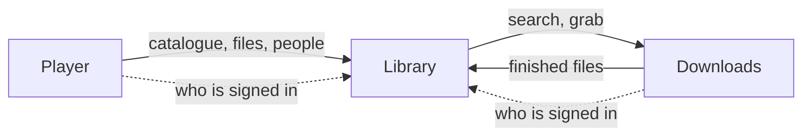
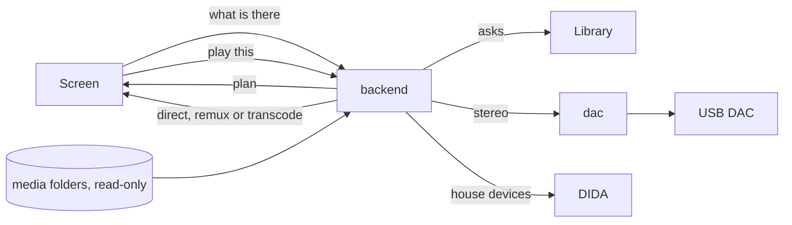

# OPUS · Player — Architecture

Player is the part of OPUS that plays: films, series, music, photographs and
radio, on a television, a computer, a phone, a USB DAC or in the car. It keeps
no catalogue of its own. What exists is asked of OPUS · Library at the moment
it is needed; what belongs to Player is where each person stopped, and how each
file is best played on each device.

## Place in the suite

OPUS is three modules that divide the work. **Library** knows what exists and
judges it; **Downloads** fetches and decides nothing; **Player** plays and
keeps only where each person stopped. Library also holds the roster of users
for all three. Each module is its own repository and its own set of
containers, and they talk over HTTP, each with its own token.



The whole suite installs with two server roles: a storage server with Library
and Downloads, and a playback server with Player.

## Principles

- **No catalogue of its own.** Player asks Library every time, the same way
  Library asks Downloads. There is nothing to keep in sync.
- **The cheapest way to play.** For each device and each file, Player plans
  direct play first, then a remux into a container the device accepts, and a
  transcode only when nothing else will do.
- **The GPU or not at all.** Decoding and encoding run on the GPU. When the GPU
  cannot, playback fails with an error rather than quietly loading the CPU.
- **Two independent choices per screen.** How a screen plays (`native`,
  `html5` or `cast`) and how it is laid out (`tv`, `desktop`, `tablet`,
  `mobile`) are chosen separately, from what the device can do and never from
  its user agent.
- **The house answers to DIDA.** The receiver, its inputs, zones and volume
  belong to the house's automation, and Player's every command to them goes
  through DIDA. The DAC on Player's own host is the exception.
- **Plugins add, the core stays whole.** An installation can add picture
  sources and ways into music as plugins. A plugin that is named and cannot be
  loaded stops the start.

## Components

| Component | Role |
|---|---|
| `backend` | FastAPI: playback plans and streaming, progress, profiles, favourites and history, radio, casting, the bridge to Library and to DIDA |
| `frontend` | SvelteKit interface, one for every surface |
| `dac` | MPD with bit-perfect output to a USB DAC; holds the DAC's queue |
| `postgres` | Postgres 18 |
| `android/` | The television app (a WebView shell with the Media3 engine) and OPUS Music with Android Auto |

## Data flow



A screen asks Player what there is, and Player asks Library. When a screen
asks to play a file, Player looks at the file and at what the device reports
it can decode, and answers with a plan: direct, remux (for example MKV into
fragmented MP4 for a browser) or transcode on the GPU. The television app
plays through Media3 and a browser through HTML5 video. Sound that is not
for this screen is cast: stereo to the DAC through MPD, multichannel to the
television's app. Progress is written back as it plays, so the next screen
picks up where the last one stopped.

## Storage

| Store | Holds |
|---|---|
| Postgres | Where each person stopped, users and their preferences, music favourites and plays, radio stations, rounds of the photo game, car-app tokens, settings |
| Media folders | `music`, `movies`, `television`, `video`, `photos`, the same content as on the storage server, mounted read-only |

Schema changes are Alembic migrations, applied when the backend starts.

## Interfaces

- **HTTP API** under `/api` for the interface and the Android apps.
- **Library**, for the catalogue, the people and the photographs.
- **DIDA**, with Player's own machine credential, for the receiver and its
  inputs, zones and volume, and for the few household facts the television
  launcher shows; no DIDA secret is put into the app.
- **DIDA's OPUS adapter** reads what Player's television app and DAC are doing
  and hands the house's orders to Player, the same way Player's own screens do.

## Security

People are checked against Library's roster: a person signs in once and
carries the suite's session cookie; the television box holds a revocable
session of its own, and the car app a token of its own. The playback server is
enrolled from the storage server with an enrollment file, written with mode
`0600`, which carries Library's address, Player's token for Library and the
suite's session key.

## Deployment

Player runs in containers from `docker-compose.yml` on the playback server,
beside the GPU, the HDMI output and the DAC. `install.sh` takes the enrollment
file and the media root; `OPUS_RENDER_DEVICE` names the GPU's render node. The
interface is on port `5283`, and the Android apps are served from Player's
settings.

## Extending

- **A plugin:** a directory under the path `OPUS_PLUGINS` names, with an
  `opus-plugin.toml` that points the `opus-player` module at the object it
  hands Player (see `backend/opus/plugins.py`): picture hosts, ways into music
  and the words for both.
- **A surface or a way of playing:** the plan in `backend/opus/playback.py`
  and the matching surface in the frontend.

## Repository layout

```
backend/opus/         the Player application
  api/routers/        play, progress, explore, radio, cast, photos, launcher, …
  playback.py         playback plans
  library.py          the client for Library
  house.py            what Player asks of DIDA
  dac.py              the DAC and its MPD
backend/opus_core/    shared with the other modules (submodule)
backend/opus_auth/    the credential contract (submodule)
backend/alembic/      migrations
frontend/             SvelteKit interface
android/              television app and OPUS Music
dac/                  the MPD service
deploy/               deployment to own installations
install.sh            installer for the playback server
```
