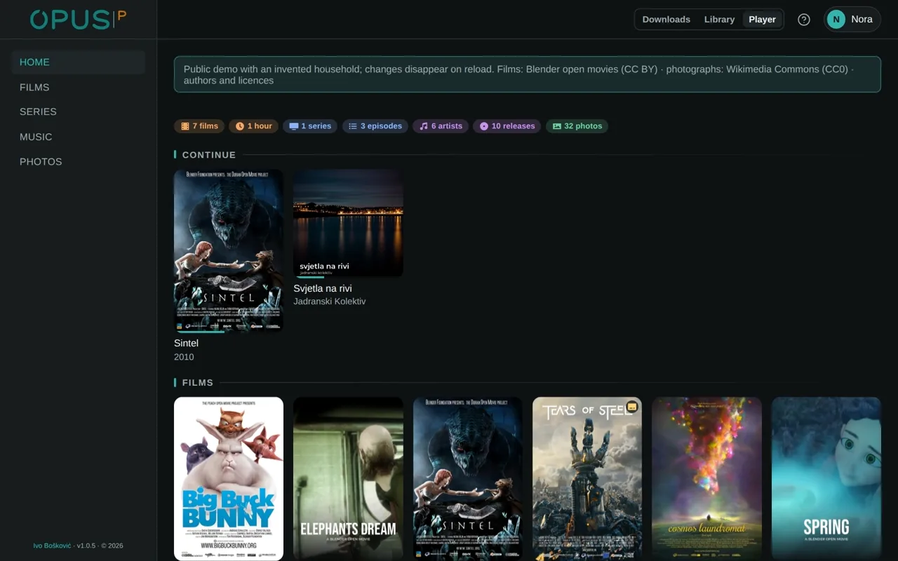
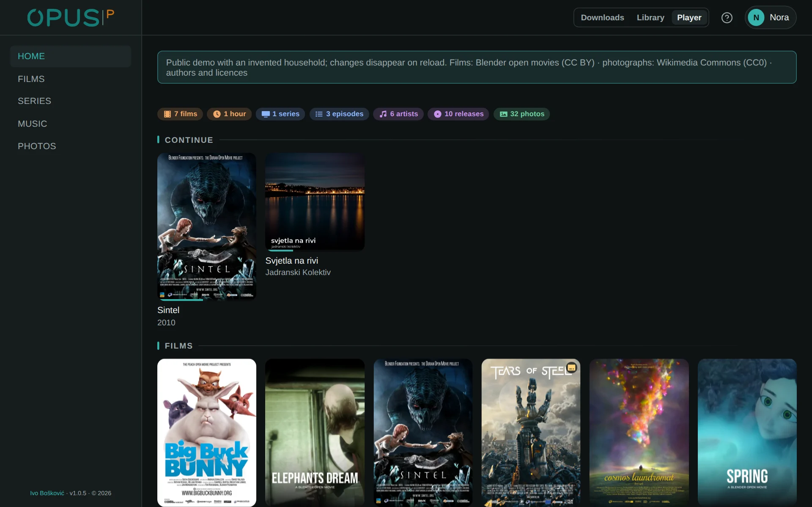
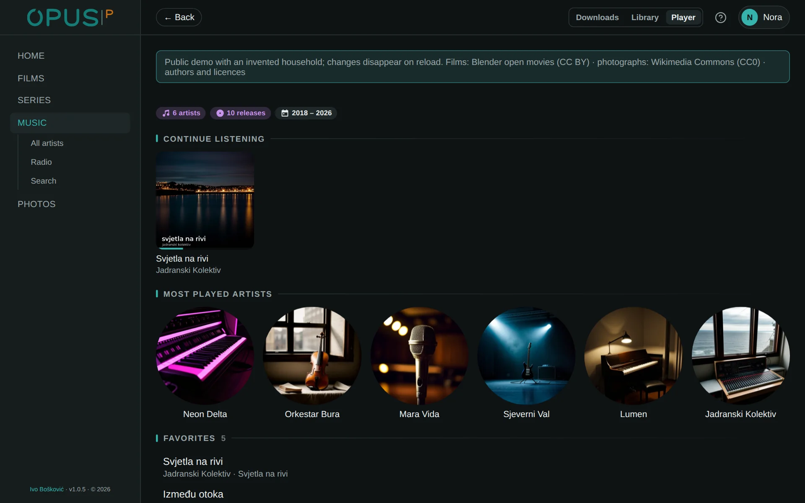
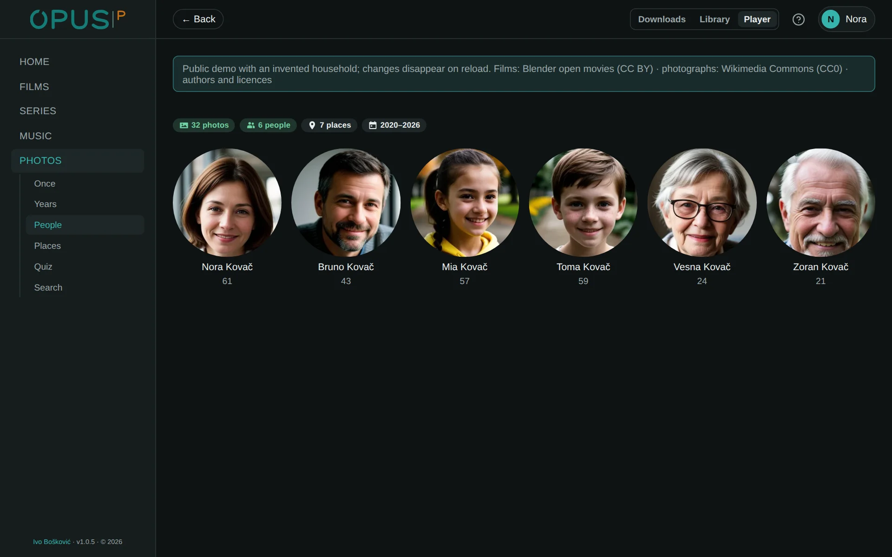
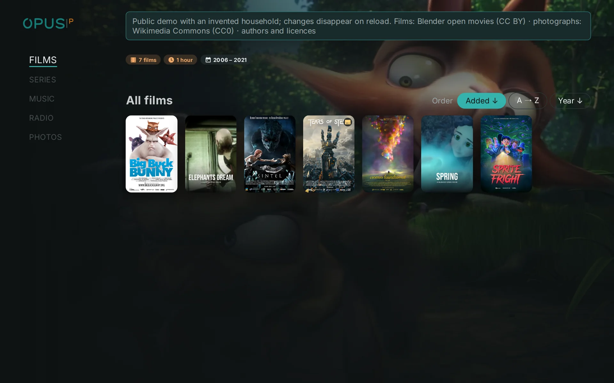

# OPUS · Player

**The everyday surface: one frontend, with playback chosen by the device it runs on.**

OPUS is a household collection of music, films, series, web video and
photographs in three modules. [Library](https://github.com/Bacinac/opus-library)
decides what is worth having, what counts as having it and what a file is
called; [Downloads](https://github.com/Bacinac/opus-downloads) acquires it from
every source behind one interface; Player plays it on whatever it runs on: a
television, a phone or a DAC. Each module is an application of its own, with its
own address and its own release; they share the sign-in, the look and the words.

**Try it:** [demo-opus.boskovic.biz](https://demo-opus.boskovic.biz), the real interface with a made-up household inside.

<p align="center"></p>

<details>
<summary>More screenshots</summary>

**Home:** what the household is in the middle of, then the films, series and records.



**Music:** where you left off, the artists played most and the songs you keep.



**Photos:** the family's people, recognised across every photograph.



**Television:** the same shelves at ten feet, walked with the remote.



</details>

## What it does

On the television it is the whole house: films, series, music, radio and the
family photographs, driven by the remote. On a phone it is the same in a pocket,
and it sends a film, a song or a photograph to the television or the DAC in the
room. It remembers how far each person got and skips the intro and the end
credits. Every member of the household has a profile of their own, and a guest
sees only films, series and music.

## What sets it apart

Playback is chosen by the device, not the person: the television plays through
its own engine with hardware decoding, a browser through what it knows itself,
and the DAC is given the original sound, DSD included. The same screen works as
an app on a phone and as a television on the wall because it is one frontend,
not three apps.

## How it works

Two choices are made independently for every screen.

**Playback.** `native` is the Android TV app, which plays through Media3 and
asks the server for a plan: direct, remux or transcode. `html5` is a browser:
direct play, MKV remuxed to fragmented MP4, and a transcode only when the device
says it would otherwise burn its CPU. `cast` is sound that is not this screen's:
stereo to the DAC on the playback server through the `dac` service, multichannel
to the television's app.

**Surface.** `tv` (ten feet, the remote, spatial focus), `desktop`, `tablet` and
`mobile` (one hand, navigation at the bottom), chosen from what the device can do
(pointer, hover, width) and never from the user agent. A laptop plugged into a
television is the ten-foot surface with browser playback.

Player keeps no catalogue. Everything about what exists is asked of Library on
the spot; what belongs to Player is where each person stopped. Decoding and
encoding happen on the GPU or not at all: when the GPU cannot, playback fails
with an error instead of quietly loading the CPU.

- `backend/` — playback plans, progress, profiles, the bridge to Library
- `frontend/` — the one interface for every surface
- `android/` — the television app and OPUS Music with Android Auto
- `dac/` — bit-perfect output to a USB DAC through MPD

The system map is in [ARCHITECTURE.md](ARCHITECTURE.md).

## Technology

Python 3.14, FastAPI and SQLAlchemy 2.1, Postgres 18, SvelteKit 2 and Svelte 5.
On the television an Android shell with a WebView and the Media3 engine, and a
separate Android Auto app for the car. Films, music and photographs come from
OPUS · Library. Everything runs in containers.

## Install

OPUS needs Docker with Compose v2, `python3` and `curl`. Player belongs on the
playback server, beside the GPU, the HDMI output and the DAC.

Player is installed as part of the OPUS suite: the storage server's installer
writes an enrollment file for Player, and the playback server is installed with
it. See the
[suite guide](https://github.com/Bacinac/opus-library/blob/main/suite/README.md).

On its own, from a clone:

```bash
git clone --recurse-submodules https://github.com/Bacinac/opus-player.git
cd opus-player
./install.sh --enrollment=/secure/path/opus-player.enrollment.env \
  --media-root=/mnt/media
```

`--media-root` holds the five media folders (`music`, `movies`, `television`,
`video`, `photos`) with the same contents as the storage server's, mounted
read-only; OPUS does not mount remote filesystems itself. The interface is on
port `5283`. The Android apps are served from Player's settings once it runs.

## Upgrade

```bash
git pull --recurse-submodules
./install.sh
```

The installer is idempotent: it rebuilds and restarts, and keeps every secret
and the database.

## Development

```bash
docker compose up -d
```

Backend on `:8098`, interface on `:5283`, Postgres only inside the compose
network. `./check.sh` runs every check and test; `android/build.sh` builds the
Android apps.

## License

OPUS · Player is licensed under
[PolyForm Noncommercial 1.0.0](LICENSE.md): free for personal and
non-commercial use. Commercial use requires a separate license; write to
[ivo.boskovic.zg@gmail.com](mailto:ivo.boskovic.zg@gmail.com). External
contributions (pull requests) are not accepted.

Required Notice: Copyright (c) 2026 Ivo Bošković
